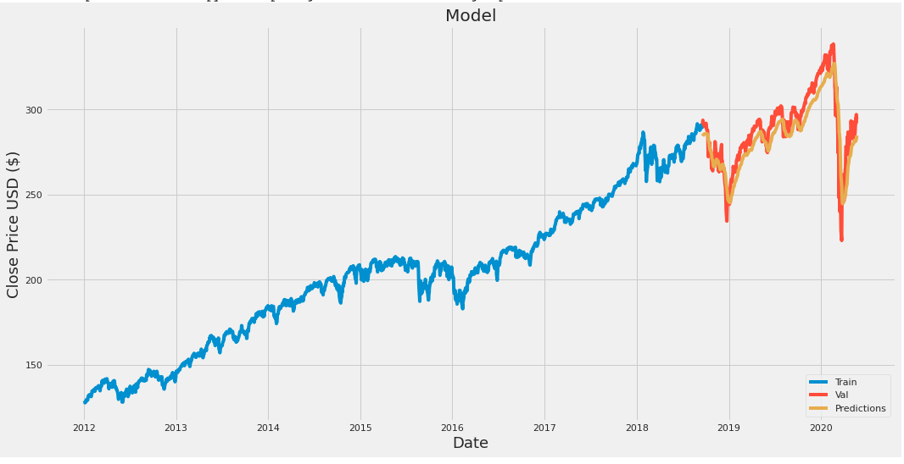

# Stock-News-NLP-Data-ML

This program takes a look at news around the economy, looking at topics that may affect the market.
Then it looks at open an close data and using keras it predicts stock prices. 

